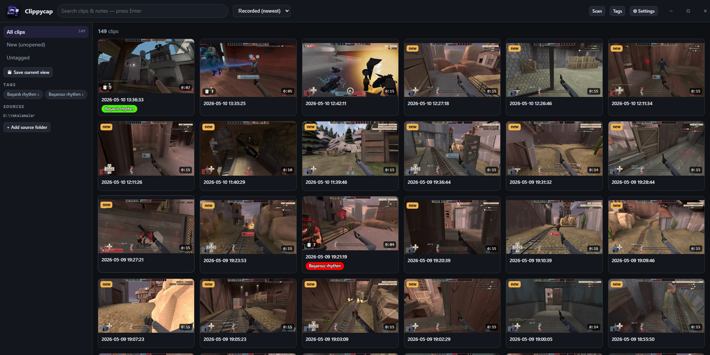
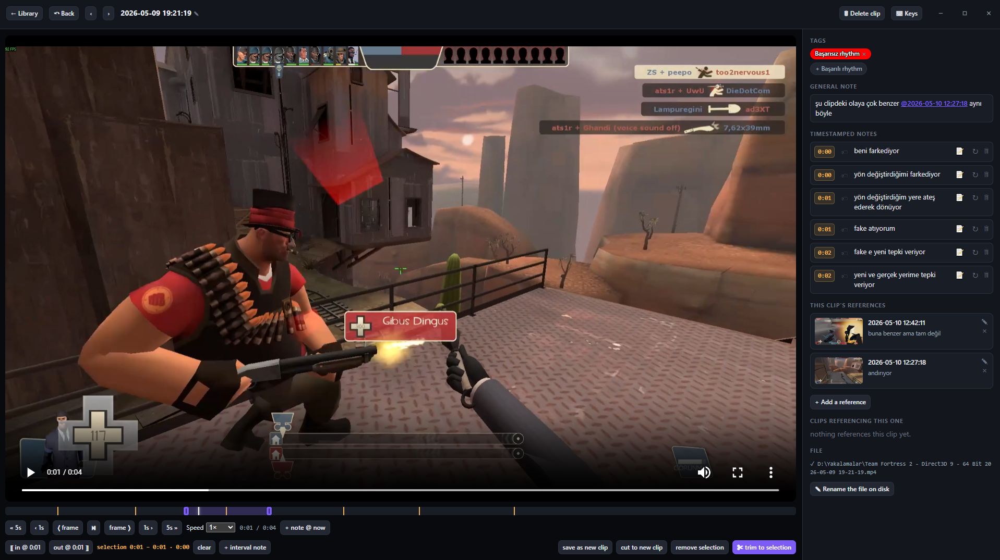

# Clippycap

**A local desktop app for organising your own video recordings — tag clips, write notes pinned to exact moments, and cross-reference one clip from another.** Built originally for reviewing gameplay recordings (catching kills, mistakes, moments worth showing someone), with a media-type-agnostic engine underneath so audio, replay files, screenshots, or anything else can plug in later without touching the core.



## Download

Pick one — both are standalone Windows builds, no Python or other dependencies to install:

| | |
|---|---|
| **[Clippycap-Setup.exe](https://github.com/fignupafya/Clippycap/releases/latest/download/Clippycap-Setup.exe)** (~104 MB) | Windows installer. Bundles FFmpeg so it works fully offline out of the box. Per-user install (no admin / UAC), Start-menu shortcut, uninstaller. Offers to install the Edge WebView2 runtime if it's missing. |
| **[Clippycap-Portable.exe](https://github.com/fignupafya/Clippycap/releases/latest/download/Clippycap-Portable.exe)** (~20 MB) | One self-contained `.exe`. Nothing to install — just download and run. FFmpeg isn't bundled (the app offers to download it on first run, or you can decline and use the client-side fallback). |

All releases: **[github.com/fignupafya/Clippycap/releases](https://github.com/fignupafya/Clippycap/releases)**.

User data — the SQLite library, thumbnails, tag images, logs, `local.toml` — always lives at `%APPDATA%\Clippycap\` and is shared between the two builds. The uninstaller never touches it; it's your data.

## What it does

- **Add a folder, scan, and your clips appear.** No managed library: Clippycap walks the folders you point it at, hashes each file, and stores everything keyed by content. Move, rename, or reorganise files however you want — Clippycap finds them again by hash and keeps every tag, note, and cross-reference intact. A missing file is marked *missing*, never deleted, and is restored the moment it reappears.
- **Flat, user-defined tags.** A tag is a name, a colour, and either an emoji icon or an uploaded image. No nested hierarchies, no presets. Filter the library by any combination.
- **General notes plus notes pinned to a moment in the video.** Each clip carries a free-form write-up *and* a timeline of timestamped notes. The detail view shows them as markers on the playhead bar; clicking a note seeks the player, dragging it retimes the note.
- **Cross-reference clips.** Type `@another-clip` in any note and Clippycap links them automatically. You can also reference a specific *moment* of another clip — useful for "the kill that set up the play I'm reviewing here." The detail view shows incoming and outgoing references in dedicated panels.
- **Fast full-text search.** SQLite + FTS5 over titles, notes, and tag names. Saved views remember filter combinations you re-open often.
- **A built-in rich player.** Frame-step, variable speed, IN/OUT trim handles on the timeline, draggable note markers. Optional FFmpeg-backed edit operations (trim, export, …) when FFmpeg is available.
- **A real desktop window, not a browser tab.** Frameless WebView2 window with the app's own HTML title bar (logo, global search, drag region, custom min / max / close). Falls back to a chromeless Chrome/Edge `--app` window, then a normal browser tab, if WebView2 is absent.



*A clip's detail view — media player with frame-step + IN/OUT trim, the timeline carrying every timestamped note for this clip, the cross-reference panel (incoming and outgoing), per-clip tags, and the edit controls.*

## Quick start

1. Download `Clippycap-Setup.exe` (above) and run it.
2. Open Clippycap → **Settings → Sources** → add a folder of videos.
3. Click **Scan**. Clippycap hashes and indexes everything in the background.
4. Click any clip to open the detail view; add tags, write notes, link to other clips.

## Architecture (one-paragraph version)

Layered / hexagonal: a pure `core/` (entities, value objects, ports — no I/O), a thin `app/` (use-case services), `infra/` (SQLite, FFmpeg adapters, the scanner, identity strategies), an `api/` (FastAPI, which also serves the prebuilt SPA), and `web/` (Svelte 5 + Vite + TypeScript). New media types and features land in `plugins/` and `media_types/` — the core never branches on file extension. Files are identified by **BLAKE3 content hash** with a `(path, size, mtime)` cache so rescans are fast. Configuration is *data*: `config/default.toml` is the single source of all defaults, layered with a per-user `local.toml`; a missing key is a hard error, never a silent fallback. FFmpeg / FFprobe are held through a *mutable* `FfmpegToolsHolder` so installs and path changes take effect with no restart. Full design and the decision log in [`ARCHITECTURE.md`](./ARCHITECTURE.md).

**Stack:** Python 3.13 · FastAPI · SQLite (FTS5) · pywebview + WebView2 · Svelte 5 + Vite + TypeScript · FFmpeg / FFprobe. (Python 3.13 not 3.14 because pywebview's `pythonnet` dep has no 3.14 wheels yet; nothing in the code is 3.14-specific.)

## Build from source

```powershell
powershell -ExecutionPolicy Bypass -File build.ps1
```

`build.ps1` (at the repo root) builds the web UI, runs PyInstaller (one-file portable + a one-folder build), downloads a standalone FFmpeg into `bin\` if Inno Setup is installed, runs Inno Setup to produce the installer, then moves the two `.exe` files into the repo root and removes the temporary `dist\` / `build\`. Prerequisites: Python 3.13 with a `.venv` at the repo root, Node.js + npm, and — only for the installer — [Inno Setup 6](https://jrsoftware.org/isdl.php). Details and knobs in [`packaging/README.md`](./packaging/README.md).

## Development

```powershell
py -3.13 -m venv .venv
.venv\Scripts\python -m pip install -e ".[dev,window]"   # backend + tests/lint + pywebview
npm --prefix web install                                  # frontend deps (once)
npm --prefix web run build                                # emits web/dist/, the backend serves it at "/"
```

Run the app: `.venv\Scripts\python -m clippycap` (opens the desktop window). Or double-click [`Clippycap.bat`](./Clippycap.bat). The interactive API docs live at `/docs` once the server is up.

CLI flows:

```powershell
.venv\Scripts\python -m clippycap add-source "D:\path\to\clips"
.venv\Scripts\python -m clippycap scan
.venv\Scripts\python -m clippycap run --browser     # use the default browser instead of the native window
```

Frontend dev loop with hot reload: in one terminal `set CLIPPYCAP__SERVER__PORT=8765 && .venv\Scripts\python -m clippycap run --no-browser`; in another `npm --prefix web run dev` — Vite proxies `/api`, `/media`, `/thumbnails` to the backend.

Quality gates:

```powershell
.venv\Scripts\python -m pytest -q
.venv\Scripts\python -m ruff check src tests
.venv\Scripts\python -m mypy src/clippycap
```

65 pytest tests pass; ruff + mypy `--strict` clean.

## License

PolyForm Noncommercial — see [`LICENSE`](./LICENSE). Use it freely; the copyright notice has to travel with the source.

FFmpeg attribution (when bundled in the installer): see [`THIRD_PARTY_NOTICES.txt`](./THIRD_PARTY_NOTICES.txt).
